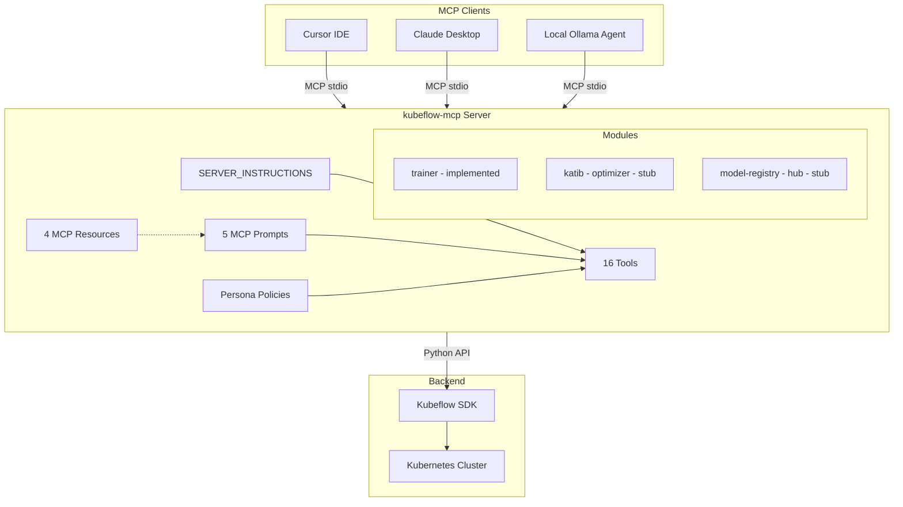
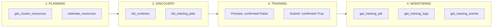
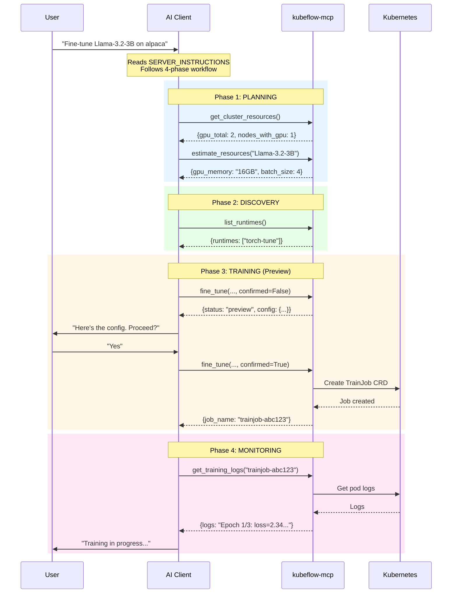
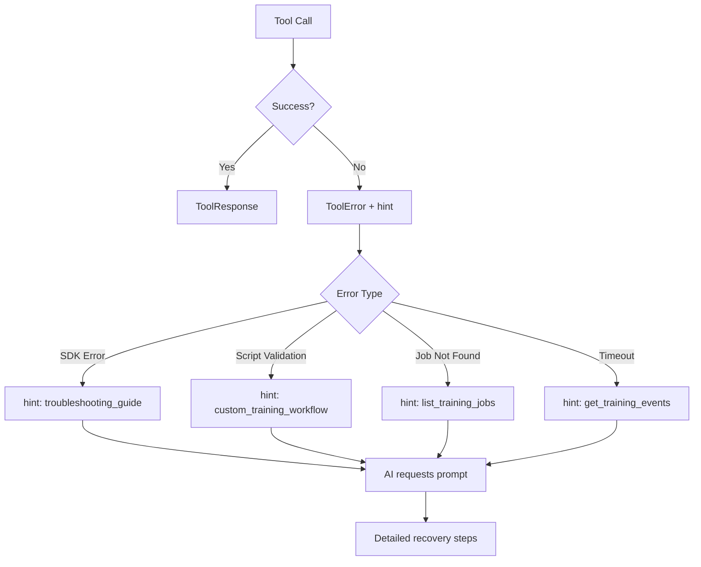
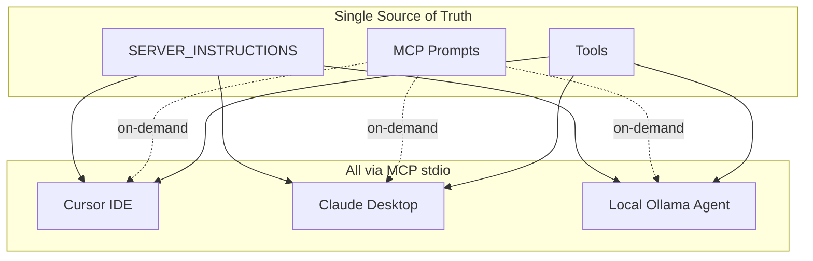
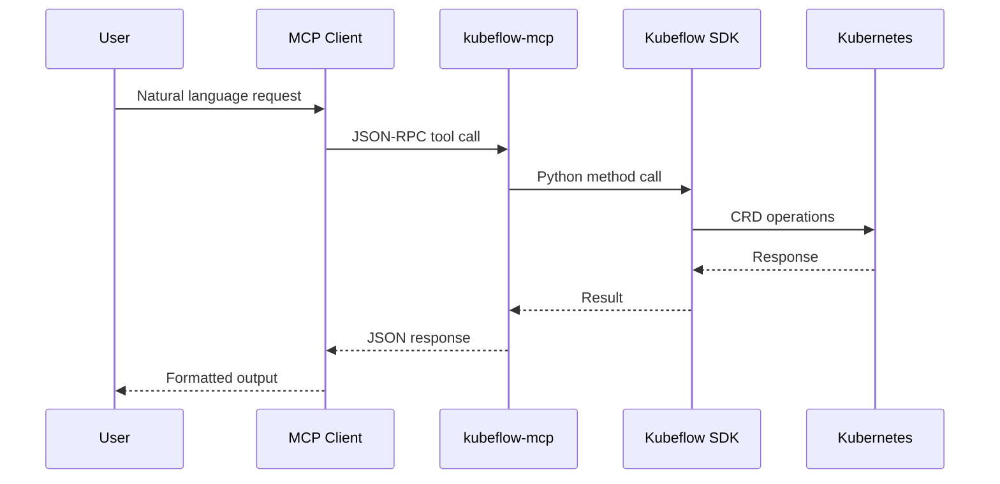

# Kubeflow MCP Server Architecture

## Overview

The MCP server acts as a translation layer between AI assistants and Kubeflow's training infrastructure.

**All clients connect via the same MCP stdio protocol**, ensuring consistent behavior and access to tools, prompts, and server instructions.

## Module Structure

| Directory | Purpose | Key Files |
|-----------|---------|-----------|
| `core/` | Server infrastructure | `server.py`, `prompts.py`, `resources.py`, `policy.py`, `config.py`, `security.py`, `resilience.py` |
| `trainer/` | Kubeflow Training tools | `api/planning.py`, `api/training.py`, `api/discovery.py`, `api/monitoring.py`, `api/lifecycle.py` |
| `agents/` | Local agent implementations | `ollama.py`, `dynamic_tools.py`, `mcp_client.py` |
| `optimizer/` | Katib integration | Stub for Phase 2 |
| `hub/` | Model Registry integration | Stub for Phase 3 |
| `common/` | Shared utilities | `types.py`, `constants.py`, `utils.py` |

## Tool Categories

Tools are organized by workflow stage:

| Category | Purpose | Tools |
|----------|---------|-------|
| **planning** | Check resources before training | `get_cluster_resources`, `estimate_resources` |
| **training** | Submit training jobs | `fine_tune`, `run_custom_training`, `run_container_training` |
| **discovery** | Find jobs and runtimes | `list_training_jobs`, `get_training_job`, `list_runtimes`, `get_runtime`, `get_runtime_packages` |
| **monitoring** | Track job progress | `get_training_logs`, `get_training_events`, `wait_for_training` |
| **lifecycle** | Manage running jobs | `delete_training_job`, `suspend_training_job`, `resume_training_job` |

## Workflow & Prompts

### Critical Workflow (SERVER_INSTRUCTIONS)

All clients receive the same workflow guidance via `SERVER_INSTRUCTIONS`:

### MCP Prompts (On-Demand Guidance)

Prompts provide detailed, parameterized guidance without bloating the system prompt:

| Prompt | Parameters | Purpose |
|--------|------------|---------|
| `fine_tuning_workflow` | `model`, `dataset` | Step-by-step LLM fine-tuning guide |
| `custom_training_workflow` | `training_type` | Script or container training guide |
| `troubleshooting_guide` | `error_type` | Diagnose OOM, pending, image pull, NCCL errors |
| `resource_planning` | `model` | GPU memory and batch size recommendations |
| `monitoring_workflow` | `job_name` | Monitor progress and debug failures |

### MCP Resources (Read-Only Reference Data)

Resources provide cacheable, read-only data that clients can fetch without consuming tool call quota:

| Resource URI | Content |
|--------------|---------|
| `trainer://models/supported` | Tested model configurations with GPU requirements |
| `trainer://runtimes/info` | Runtime documentation and usage |
| `trainer://guides/quickstart` | Quick start guide for new users |
| `trainer://guides/troubleshooting` | Troubleshooting quick reference |

### Tool Tags (Phase-Based Discovery)

Tools include `tags` in their annotations for phase-based discovery:

| Tag | Phase | Tools |
|-----|-------|-------|
| `planning` | 1 | `get_cluster_resources`, `estimate_resources` |
| `discovery` | 2 | `list_*`, `get_runtime*` |
| `training` | 3 | `fine_tune`, `run_custom_training`, `run_container_training` |
| `monitoring` | 4 | `get_training_logs`, `get_training_events`, `wait_for_training` |
| `lifecycle` | - | `delete_*`, `suspend_*`, `resume_*` |

### Fine-Tuning Workflow Sequence

### Error Recovery with Hints

When tools return errors, they include hints pointing to relevant prompts:

| Error Type | Hint | Recovery Action |
|------------|------|-----------------|
| Training SDK errors | `troubleshooting_guide`, `resource_planning` | Diagnose, check resources |
| Script validation failed | `custom_training_workflow` | Fix script or use container |
| Job not found | `list_training_jobs` | Find correct job name |
| Monitoring failures | `monitoring_workflow` | Step-by-step debugging |
| Timeout | `get_training_events` | Check K8s scheduling |

### Client Consistency

All clients connect via the same MCP stdio protocol:

| Client | Protocol | Tools | Instructions | Prompts |
|--------|----------|-------|--------------|---------|
| Cursor IDE | MCP stdio | MCP protocol | `SERVER_INSTRUCTIONS` | MCP prompts API |
| Claude Desktop | MCP stdio | MCP protocol | `SERVER_INSTRUCTIONS` | MCP prompts API |
| Local Agent (full) | MCP stdio | MCP protocol | `SERVER_INSTRUCTIONS` | MCP prompts API |
| Local Agent (progressive/semantic) | Direct | Meta-tools | Dynamic prompt | Not available |

The default `--mode full` uses the standard MCP protocol, ensuring identical behavior across all clients.

## Token-Efficient Modes

To reduce LLM context usage, three tool loading modes are supported:

| Mode | Initial Tokens | Reduction | Mechanism |
|------|---------------|-----------|-----------|
| **Full** | ~900 | baseline | All tools via MCP protocol |
| **Progressive** | ~85 | -91% | 3 meta-tools with hierarchical discovery |
| **Semantic** | ~69 | -92% | 2 meta-tools with embedding-based search |

Note: `static` and `mcp` are legacy aliases for `full` mode.

## Access Control

### Persona-Based Filtering

| Persona | Access Level | Tools |
|---------|--------------|-------|
| `readonly` | View only | `list_*`, `get_*` |
| `data-scientist` | + Training | `fine_tune`, `run_custom_training`, `delete_training_job` |
| `ml-engineer` | + Lifecycle | `run_container_training`, `suspend_*`, `resume_*` |
| `platform-admin` | Unrestricted | All tools |

### Policy-Based Filtering

Custom policies in `~/.kf-mcp-policy.yaml` can further restrict access:
- **allow**: Whitelist tools or categories
- **deny**: Blacklist tools or risk levels (e.g., `risk:destructive`)
- **namespaces**: Restrict to specific Kubernetes namespaces

## Preview-Before-Submit Pattern

Training tools use a two-phase confirmation to prevent accidental resource consumption:

| Phase | Call | Returns |
|-------|------|---------|
| 1. Preview | `fine_tune(..., confirmed=False)` | `{"status": "preview", "config": {...}}` |
| 2. Submit | `fine_tune(..., confirmed=True)` | `{"success": True, "job_name": "..."}` |

## Extension Points

### Adding a New Tool

1. Create function in appropriate `api/*.py` module
2. Add to `TOOLS` list in `trainer/__init__.py`
3. Add to `TOOL_CATEGORIES` dict
4. Add annotations in `core/server.py`
5. Write unit tests

### Adding a New Client Module

1. Create `src/kubeflow_mcp/newclient/` directory
2. Implement tools in `api/` subdirectory
3. Export `TOOLS` list in `__init__.py`
4. Register in `core/server.py` `CLIENT_MODULES`
5. Add optional dependency in `pyproject.toml`

## Data Flow

## Related Documentation

- [CONTRIBUTING.md](CONTRIBUTING.md) - How to contribute
- [DEVELOPMENT.md](docs/DEVELOPMENT.md) - Development setup
- [README.md](README.md) - User documentation
- [Kubeflow Training Operator](https://www.kubeflow.org/docs/components/training/)
