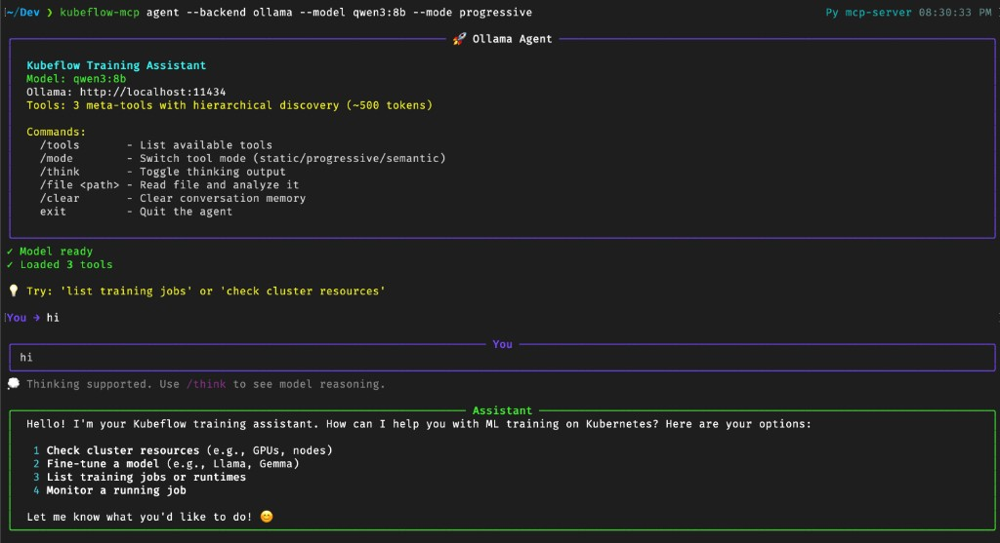
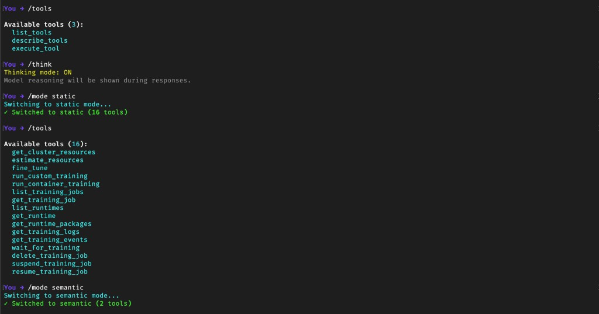
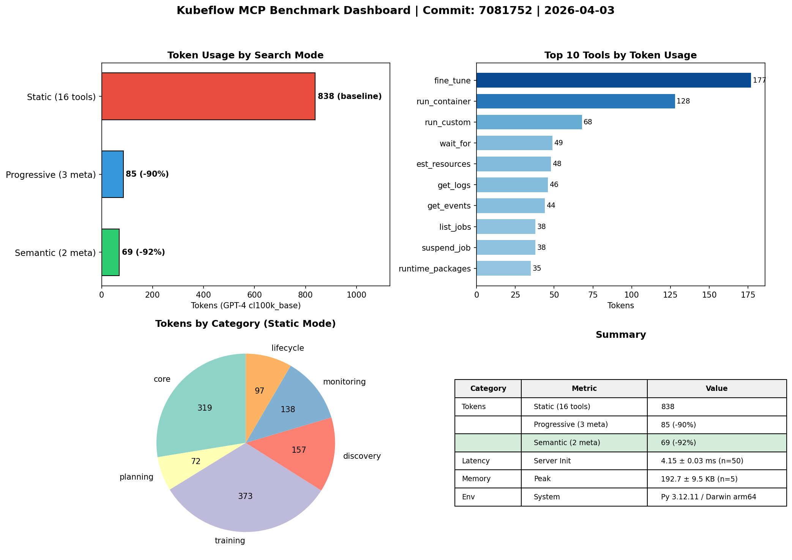

# Kubeflow MCP Server

[](https://www.python.org/downloads/)
[](https://pypi.org/project/kubeflow/)
[](LICENSE)
[](https://modelcontextprotocol.io/)

AI-powered interface for Kubeflow Training via [Model Context Protocol (MCP)](https://modelcontextprotocol.io/).
Enable your AI assistants to manage distributed training jobs, fine-tune LLMs, and monitor workloads
on Kubernetes — all through natural language.


## Overview

The Kubeflow MCP Server bridges AI assistants/agents with Kubeflow's training infrastructure. Instead of writing YAML manifests or learning Kubernetes APIs, simply describe what you want to train and let AI handle the complexity.

### Key Benefits

- **Natural Language Interface**: Describe training jobs in plain English — "fine-tune Llama-3 on my dataset with 4 GPUs"
- **Smart Resource Planning**: AI estimates GPU/memory requirements before job submission
- **Real-time Monitoring**: Stream logs, track progress, and debug failures conversationally
- **Safe by Design**: Preview configurations before submission, built-in validation and guardrails
- **Multi-Client Support**: Works with Claude Desktop, Cursor IDE, MCP Inspector, or custom agents

### Compatibility

| Component | Version | Notes |
|-----------|---------|-------|
| **Kubeflow SDK** | ≥0.4.0 | TrainerClient API for training jobs |
| **Kubernetes** | ≥1.28 | With TrainJob CRD installed |
| **Python** | ≥3.10 | Async support required |

This MCP server wraps the [Kubeflow Training SDK](https://pypi.org/project/kubeflow/) `TrainerClient` API. All training operations (fine-tuning, custom scripts, container jobs) use SDK types like `BuiltinTrainer`, `CustomTrainer`, `TorchTuneConfig`, and `LoraConfig`.

## Quick Start

### Install

```bash
# Using uv (recommended)
pip install uv
uv sync

# Or with pip
pip install kubeflow-mcp
```

### Configure Your AI Assistant

<details>
<summary><b>Cursor IDE</b></summary>

Add to `~/.cursor/mcp.json`:

```json
{
  "mcpServers": {
    "kubeflow": {
      "command": "kubeflow-mcp",
      "args": ["serve", "--persona", "ml-engineer", "--transport", "stdio"]
    }
  }
}
```

**Options:** `--persona` (readonly|data-scientist|ml-engineer|platform-admin), `--transport` (stdio|http), `--log-level` (DEBUG|INFO|WARNING|ERROR)

Requires `pip install kubeflow-mcp` first.
</details>

<details>
<summary><b>Claude Desktop</b></summary>

Add to `~/Library/Application Support/Claude/claude_desktop_config.json` (macOS) or
`%APPDATA%\Claude\claude_desktop_config.json` (Windows):

```json
{
  "mcpServers": {
    "kubeflow": {
      "command": "kubeflow-mcp",
      "args": ["serve", "--persona", "ml-engineer", "--transport", "stdio"]
    }
  }
}
```

**Options:** `--persona` (readonly|data-scientist|ml-engineer|platform-admin), `--transport` (stdio|http), `--log-level` (DEBUG|INFO|WARNING|ERROR)

Requires `pip install kubeflow-mcp` first.
</details>

<details>
<summary><b>MCP Inspector (Debug)</b></summary>

```bash
npx @modelcontextprotocol/inspector uv run kubeflow-mcp serve
```
</details>

### Try It Out

Once configured, ask your AI assistant:

```
"What training jobs are running in my cluster?"
"Fine-tune google/gemma-2b on squad dataset with 2 GPUs"
"Show me logs for the failed training job"
"How many GPUs do I need to fine-tune Llama-3-8B?"
```

## Available Tools

| Category | Tools | Description |
|----------|-------|-------------|
| **Planning** | `get_cluster_resources`, `estimate_resources` | Check cluster capacity, estimate job requirements |
| **Training** | `fine_tune`, `run_custom_training`, `run_container_training` | Submit LLM fine-tuning or custom training jobs |
| **Discovery** | `list_training_jobs`, `get_training_job`, `list_runtimes`, `get_runtime` | Browse jobs and available training runtimes |
| **Monitoring** | `get_training_logs`, `get_training_events`, `wait_for_training` | Stream logs, watch events, wait for completion |
| **Lifecycle** | `delete_training_job`, `suspend_training_job`, `resume_training_job` | Manage job lifecycle |

### Example: Fine-tune an LLM

```python
fine_tune(
    model="google/gemma-2b",
    dataset="squad",
    num_nodes=2,
    gpu_per_node=1,
    confirmed=True
)
```

### Example: Resource Estimation

Ask: *"How much GPU memory do I need for Llama-3-70B?"*

```json
{
  "model": "meta-llama/Llama-3-70B",
  "parameters": "70B",
  "estimated_memory_gb": 140,
  "recommended_gpus": 4,
  "gpu_type": "A100-80GB"
}
```

## CLI Reference

```bash
# Server
kubeflow-mcp serve                              # Start MCP server
kubeflow-mcp serve --clients trainer            # Specify client
kubeflow-mcp serve --persona ml-engineer        # Set persona
kubeflow-mcp status                             # Show server status

# Agent
kubeflow-mcp agent --backend ollama --model qwen3:8b
kubeflow-mcp agent --backend ollama --mode progressive
kubeflow-mcp agent --backend ollama --thinking  # Enable thinking output
```

## Local Agent (Ollama)

Run a fully local AI agent — no cloud APIs required:

```bash
pip install kubeflow-mcp[agents]    # Install agent dependencies
ollama pull qwen3:8b                # Pull model with tool-calling support
kubeflow-mcp agent --backend ollama --model qwen3:8b
```



**Example Session:**
```
You → hi
Assistant → Hello! I can help you with: Check cluster resources, Fine-tune models...

You → /file examples/mnist_train.py
✓ Read mnist_train.py (140 lines)

You → train this with 2 workers
Agent → [checks resources] → [shows preview] Confirm?

You → yes
Agent → ✓ Created training job: mnist-train-abc123
```

<details>
<summary><b>Token-Efficient Tool Modes</b></summary>



Optimize token usage with different loading strategies.
See [dynamic toolset patterns](https://www.speakeasy.com/blog/100x-token-reduction-dynamic-toolsets).

| Mode | Strategy | Tokens | Reduction |
|------|----------|--------|-----------|
| `static` | All 16 tools loaded | 838 | baseline |
| `progressive` | 3 meta-tools for discovery | 85 | -90% |
| `semantic` | 2 meta-tools + embeddings | 69 | -92% |


**How Progressive Discovery Works:**
Uses 3 meta-tools instead of loading all 16:
1. `list_tools(prefix)` - Discover tools by category
2. `describe_tools([names])` - Get full schema
3. `execute_tool(name, args)` - Run the tool

**How Semantic Search Works:**
Uses embeddings to find relevant tools:
1. `find_tools(query)` - Search by description
2. `execute_tool(name, args)` - Run the tool

Requires: `pip install sentence-transformers`
</details>

<details>
<summary><b>Recommended Ollama Models</b></summary>

| Model | Context | RAM | Tool Calling | Thinking |
|-------|---------|-----|--------------|----------|
| `qwen2.5:7b` | 32K | 7GB | ✅ | ❌ |
| `qwen3:8b` | 32K | 8GB | ✅ | ✅ |
| `llama3.2:3b` | 8K | 3GB | ✅ | ❌ |
| `phi4-mini-reasoning` | 16K | 8GB | ✅ | ✅ |

For 8K context models, use `--mode progressive` or `--mode semantic`.
</details>

<details>
<summary><b>All Agent Commands</b></summary>

```bash
kubeflow-mcp agent --backend ollama                       # static (default)
kubeflow-mcp agent --backend ollama --mode progressive    # hierarchical
kubeflow-mcp agent --backend ollama --mode semantic       # embedding search
```
| Command | Description |
|---------|-------------|
| `/tools` | List available tools |
| `/mode [name]` | Switch tool mode (static/progressive/semantic) |
| `/think` | Toggle thinking output |
| `/file <path>` | Read and analyze a file |
| `/clear` | Clear conversation memory |
| `exit` | Quit the agent |
</details>

## Cursor Skills

Enhance AI context with training skills:

```
@skills/trainer/SKILL.md
```

Skills provide domain knowledge about Kubeflow training patterns, helping the AI make better decisions.

## Development

```bash
# Setup
make dev              # Install all dev dependencies

# Quality checks
make lint             # Run ruff linter
make format           # Auto-format code
make check            # Lint + type check
make pre-commit       # Run all checks before commit

# Testing
make test             # Run all tests
make test-unit        # Unit tests only
make test-cov         # With coverage report

# Server
make serve            # Start MCP server
make status           # Show server status
```

See `make help` for all available commands.

### Benchmarks

Token usage and performance benchmarks across search modes:



```bash
# Generate benchmark dashboard
make benchmark
```

| Mode | Tokens | Reduction | Use Case |
|------|--------|-----------|----------|
| Static | 838 | baseline | Full capability, large context |
| Progressive | 85 | -90% | Hierarchical discovery |
| Semantic | 69 | -92% | Embedding-based search |

## Roadmap

| Component | Status | Tools |
|-----------|--------|-------|
| **TrainerClient** | ✅ Available | 16 tools |
| **OptimizerClient** | 🚧 Planned | Hyperparameter tuning |
| **ModelRegistryClient** | 🚧 Planned | Model versioning |
| **SparkClient** | 🚧 Planned | Data processing |

## Community

- **Slack**: Join [#kubeflow-ml-experience](https://www.kubeflow.org/docs/about/community/#kubeflow-slack-channels)
- **Meetings**: [Kubeflow SDK and ML Experience](https://bit.ly/kf-ml-experience) bi-weekly calls
- **GitHub**: Issues and PRs welcome!

## Contributing

We welcome contributions! Areas where help is needed:

- [ ] OptimizerClient integration (Katib)
- [ ] ModelRegistryClient integration
- [ ] Additional training runtimes
- [ ] More agent backends (OpenAI, Anthropic API)

See [CONTRIBUTING.md](CONTRIBUTING.md) for guidelines.

## License

Apache-2.0
