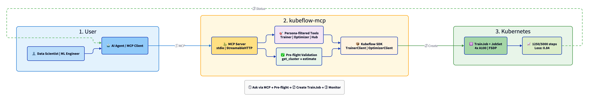
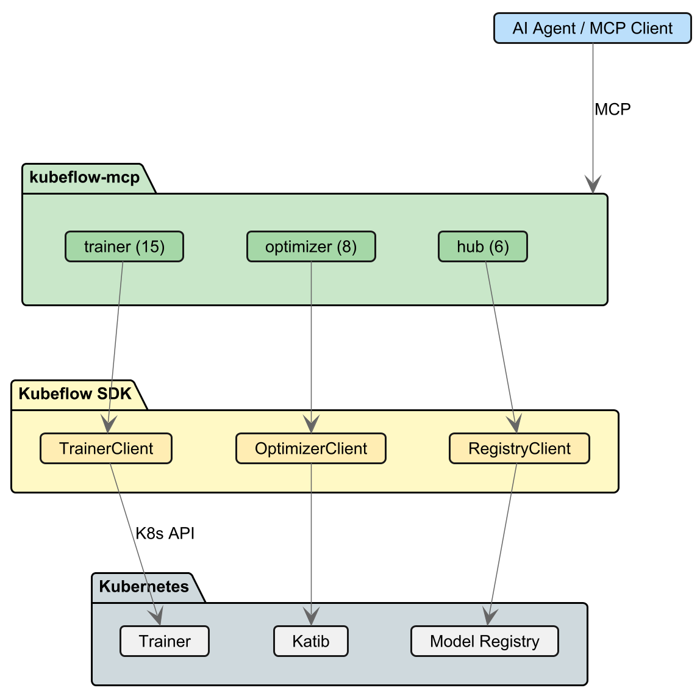

# Kubeflow MCP Server

[](https://www.python.org/downloads/)
[](LICENSE)
[](https://modelcontextprotocol.io/)

AI-powered interface for Kubeflow Training via [Model Context Protocol (MCP)](https://modelcontextprotocol.io/).
Enable your AI assistants to manage distributed training jobs, fine-tune LLMs, and monitor workloads
on Kubernetes — all through natural language.



## Overview

The Kubeflow MCP Server bridges AI assistants (Claude, Cursor, custom agents) with Kubeflow's
training infrastructure. Instead of writing YAML manifests or learning Kubernetes APIs, simply
describe what you want to train and let AI handle the complexity.

### Key Benefits

- **Natural Language Interface**: Describe training jobs in plain English — "fine-tune Llama-3 on my dataset with 4 GPUs"
- **Smart Resource Planning**: AI estimates GPU/memory requirements before job submission
- **Real-time Monitoring**: Stream logs, track progress, and debug failures conversationally
- **Safe by Design**: Preview configurations before submission, built-in validation and guardrails
- **Multi-Client Support**: Works with Claude Desktop, Cursor IDE, MCP Inspector, or custom Ollama agents

## Quick Start

### Install

```bash
# Using uv (recommended)
pip install uv
uv sync

# Or with pip
pip install kubeflow-mcp
```

### Configure Your AI Assistant

<details>
<summary><b>Cursor IDE</b></summary>

Add to `~/.cursor/mcp.json`:

```json
{
  "mcpServers": {
    "kubeflow": {
      "command": "uv",
      "args": ["run", "--directory", "/path/to/mcp-server", "kubeflow-mcp", "serve"]
    }
  }
}
```
</details>

<details>
<summary><b>Claude Desktop</b></summary>

Add to `~/Library/Application Support/Claude/claude_desktop_config.json` (macOS) or
`%APPDATA%\Claude\claude_desktop_config.json` (Windows):

```json
{
  "mcpServers": {
    "kubeflow": {
      "command": "uv",
      "args": ["run", "--directory", "/path/to/mcp-server", "kubeflow-mcp", "serve"]
    }
  }
}
```
</details>

<details>
<summary><b>MCP Inspector (Debug)</b></summary>

```bash
npx @modelcontextprotocol/inspector uv run kubeflow-mcp serve
```
</details>

### Try It Out

Once configured, ask your AI assistant:

```
"What training jobs are running in my cluster?"
"Fine-tune google/gemma-2b on squad dataset with 2 GPUs"
"Show me logs for the failed training job"
"How many GPUs do I need to fine-tune Llama-3-8B?"
```

## Local Agent (Ollama)

Run a fully local AI agent powered by Ollama — no cloud APIs required:

```bash
# Install with agent support
uv sync --extra agents

# Pull a model with tool-calling support
ollama pull qwen2.5:7b

# Start the interactive agent
uv run python -m kubeflow_mcp.agents.ollama --model qwen2.5:7b
```

### Token-Efficient Tool Modes

The agent supports multiple tool loading modes for different model context sizes.
Based on [dynamic toolset patterns](https://www.speakeasy.com/blog/100x-token-reduction-dynamic-toolsets):

| Mode | Tools | Tokens | Best For |
|------|-------|--------|----------|
| `static` | 16 | ~2,100 | Large context models (32K+) |
| `lite` | 5 | ~710 | Small context models (8K) |
| `progressive` | 3 meta | ~680 | Hierarchical discovery |
| `semantic` | 2 meta | ~430 | Natural language search |

```bash
# Default - all 16 tools (for qwen2.5:7b with 32K context)
uv run python -m kubeflow_mcp.agents.ollama

# Lite mode - 5 core tools (for llama3.2:3b with 8K context)
uv run python -m kubeflow_mcp.agents.ollama --mode lite

# Progressive mode - hierarchical discovery (minimal tokens)
uv run python -m kubeflow_mcp.agents.ollama --mode progressive

# Semantic mode - embedding-based search (requires sentence-transformers)
pip install sentence-transformers
uv run python -m kubeflow_mcp.agents.ollama --mode semantic
```

**Runtime commands:**
- `/mode` - Show current mode and switch (e.g., `/mode lite`)
- `/tools` - List loaded tools
- `/think` - Toggle thinking output

<details>
<summary><b>How Progressive Discovery Works</b></summary>

Instead of loading all 16 tools upfront, the agent uses 3 meta-tools:

1. **`list_tools(prefix)`** - Discover tools by category
2. **`describe_tools([names])`** - Get full schema for specific tools
3. **`execute_tool(name, args)`** - Run the discovered tool

```
User: "Fine-tune llama on squad"

Agent: list_tools("training")
→ Returns: fine_tune, run_custom_training, run_container_training

Agent: describe_tools(["fine_tune"])
→ Returns: Full parameter schema

Agent: execute_tool("fine_tune", {"model": "meta-llama/Llama-3.2-1B", "dataset": "squad"})
→ Executes the training job
```

This achieves **67% token reduction** while maintaining full functionality.
</details>

<details>
<summary><b>How Semantic Search Works</b></summary>

Uses embeddings to find relevant tools from natural language:

1. **`find_tools(query)`** - Search tools by description
2. **`execute_tool(name, args)`** - Run the found tool

```
User: "Fine-tune llama on squad"

Agent: find_tools("fine-tune a language model on dataset")
→ Returns: fine_tune (0.89), run_custom_training (0.72), ...

Agent: execute_tool("fine_tune", {"model": "meta-llama/Llama-3.2-1B", "dataset": "squad"})
```

This achieves **80% token reduction** with semantic matching.
</details>

### Recommended Models

| Model | Context | RAM | Tool Calling | Thinking |
|-------|---------|-----|--------------|----------|
| `qwen2.5:7b` | 32K | 7GB | ✅ | ❌ |
| `qwen3:8b` | 32K | 8GB | ✅ | ✅ |
| `llama3.2:3b` | 8K | 3GB | ✅ | ❌ |
| `phi4-mini-reasoning` | 16K | 8GB | ✅ | ✅ |

For 8K context models, use `--mode lite` or `--mode progressive`.

## Available Tools

| Category | Tools | Description |
|----------|-------|-------------|
| **Planning** | `get_cluster_resources`, `estimate_resources` | Check cluster capacity, estimate job requirements |
| **Training** | `fine_tune`, `run_custom_training`, `run_container_training` | Submit LLM fine-tuning or custom training jobs |
| **Discovery** | `list_training_jobs`, `get_training_job`, `list_runtimes`, `get_runtime` | Browse jobs and available training runtimes |
| **Monitoring** | `get_training_logs`, `get_training_events`, `wait_for_training` | Stream logs, watch events, wait for completion |
| **Lifecycle** | `delete_training_job`, `suspend_training_job`, `resume_training_job` | Manage job lifecycle |

### Example: Fine-tune an LLM

```python
# The AI assistant calls this behind the scenes
fine_tune(
    model="google/gemma-2b",
    dataset="squad",
    num_nodes=2,
    gpu_per_node=1,
    confirmed=True
)
```

### Example: Resource Estimation

Ask: *"How much GPU memory do I need for Llama-3-70B?"*

The server fetches model info from HuggingFace and calculates:
```json
{
  "model": "meta-llama/Llama-3-70B",
  "parameters": "70B",
  "estimated_memory_gb": 140,
  "recommended_gpus": 4,
  "gpu_type": "A100-80GB"
}
```

## CLI Reference

```bash
# Start MCP server (default)
kubeflow-mcp serve

# Specify clients and persona
kubeflow-mcp serve --clients trainer --persona ml-engineer

# Available personas: ml-engineer, admin, viewer
```

## Architecture



## Cursor Skills

Enhance AI context with training skills:

```
@skills/trainer/SKILL.md
```

Skills provide domain knowledge about Kubeflow training patterns, helping the AI make better decisions.

## Development

```bash
# Install all dependencies
uv sync --all-extras

# Run tests
uv run pytest

# Lint and type check
uv run ruff check .
uv run mypy src/

# Format code
uv run ruff format .
```

## Roadmap

| Component | Status | Tools |
|-----------|--------|-------|
| **TrainerClient** | ✅ Available | 16 tools |
| **OptimizerClient** | 🚧 Planned | Hyperparameter tuning |
| **ModelRegistryClient** | 🚧 Planned | Model versioning |
| **SparkClient** | 🚧 Planned | Data processing |

## Community

- **Slack**: Join [#kubeflow-ml-experience](https://www.kubeflow.org/docs/about/community/#kubeflow-slack-channels)
- **Meetings**: [Kubeflow SDK and ML Experience](https://bit.ly/kf-ml-experience) bi-weekly calls
- **GitHub**: Issues and PRs welcome!

## Contributing

We welcome contributions! Areas where help is needed:

- [ ] OptimizerClient integration (Katib)
- [ ] ModelRegistryClient integration
- [ ] Additional training runtimes
- [ ] More agent backends (OpenAI, Anthropic API)

See [CONTRIBUTING.md](CONTRIBUTING.md) for guidelines.

## License

Apache-2.0
