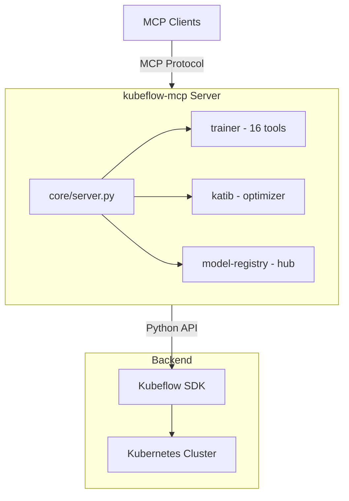
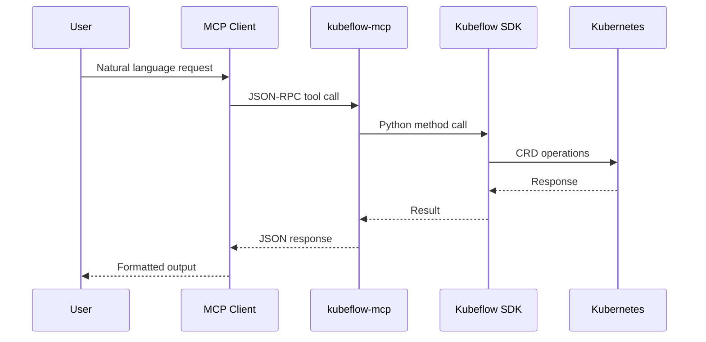

# Kubeflow MCP Server Architecture

## Overview

The MCP server acts as a translation layer between AI assistants and Kubeflow's training infrastructure.

## Module Structure

| Directory | Purpose | Key Files |
|-----------|---------|-----------|
| `core/` | Server infrastructure | `server.py`, `policy.py`, `config.py`, `security.py`, `resilience.py` |
| `trainer/` | Kubeflow Training tools | `api/planning.py`, `api/training.py`, `api/discovery.py`, `api/monitoring.py`, `api/lifecycle.py` |
| `agents/` | Local agent implementations | `ollama.py`, `dynamic_tools.py` |
| `optimizer/` | Katib integration | Stub for Phase 2 |
| `hub/` | Model Registry integration | Stub for Phase 3 |
| `common/` | Shared utilities | `types.py`, `constants.py`, `utils.py` |

## Tool Categories

Tools are organized by workflow stage:

| Category | Purpose | Tools |
|----------|---------|-------|
| **planning** | Check resources before training | `get_cluster_resources`, `estimate_resources` |
| **training** | Submit training jobs | `fine_tune`, `run_custom_training`, `run_container_training` |
| **discovery** | Find jobs and runtimes | `list_training_jobs`, `get_training_job`, `list_runtimes`, `get_runtime`, `get_runtime_packages` |
| **monitoring** | Track job progress | `get_training_logs`, `get_training_events`, `wait_for_training` |
| **lifecycle** | Manage running jobs | `delete_training_job`, `suspend_training_job`, `resume_training_job` |

## Token-Efficient Modes

To reduce LLM context usage, three tool loading modes are supported:

| Mode | Initial Tokens | Reduction | Mechanism |
|------|---------------|-----------|-----------|
| **Static** | 838 | baseline | All 16 tools loaded at once |
| **Progressive** | 85 | -90% | 3 meta-tools with hierarchical discovery |
| **Semantic** | 69 | -92% | 2 meta-tools with embedding-based search |

## Access Control

### Persona-Based Filtering

| Persona | Access Level | Tools |
|---------|--------------|-------|
| `readonly` | View only | `list_*`, `get_*` |
| `data-scientist` | + Training | `fine_tune`, `run_custom_training`, `delete_training_job` |
| `ml-engineer` | + Lifecycle | `run_container_training`, `suspend_*`, `resume_*` |
| `platform-admin` | Unrestricted | All tools |

### Policy-Based Filtering

Custom policies in `~/.kf-mcp-policy.yaml` can further restrict access:
- **allow**: Whitelist tools or categories
- **deny**: Blacklist tools or risk levels (e.g., `risk:destructive`)
- **namespaces**: Restrict to specific Kubernetes namespaces

## Preview-Before-Submit Pattern

Training tools use a two-phase confirmation to prevent accidental resource consumption:

| Phase | Call | Returns |
|-------|------|---------|
| 1. Preview | `fine_tune(..., confirmed=False)` | `{"status": "preview", "config": {...}}` |
| 2. Submit | `fine_tune(..., confirmed=True)` | `{"success": True, "job_name": "..."}` |

## Extension Points

### Adding a New Tool

1. Create function in appropriate `api/*.py` module
2. Add to `TOOLS` list in `trainer/__init__.py`
3. Add to `TOOL_CATEGORIES` dict
4. Add annotations in `core/server.py`
5. Write unit tests

### Adding a New Client Module

1. Create `src/kubeflow_mcp/newclient/` directory
2. Implement tools in `api/` subdirectory
3. Export `TOOLS` list in `__init__.py`
4. Register in `core/server.py` `CLIENT_MODULES`
5. Add optional dependency in `pyproject.toml`

## Data Flow

## Related Documentation

- [CONTRIBUTING.md](../CONTRIBUTING.md) - How to contribute
- [DEVELOPMENT.md](DEVELOPMENT.md) - Development setup
- [README.md](../README.md) - User documentation
- [Kubeflow Training Operator](https://www.kubeflow.org/docs/components/training/)
